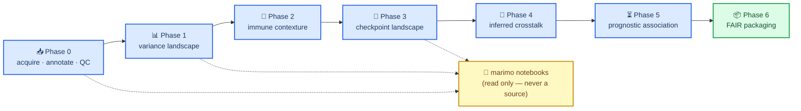

# What a public spatial-transcriptomics dataset taught me about saying no

**Status: DRAFT (P6-T7).** Not published. Every number below is produced by a
Snakemake rule in this repository and is quoted with the constraint that bounds
it. Nothing here is a claim about biology that the assay cannot support.

---

## 🧭 The setup

There is a NanoString GeoMx DSP dataset in GEO — accession
[GSE200563][^geo] — with **120 areas of illumination (AOIs)** from **35
non-small-cell lung cancer patients plus 7 non-tumour brain controls**. Matched
primary lung tumours and brain metastases from the same people, profiled on the
whole-transcriptome panel, split into tumour and non-tumour compartments. It has
already been published on[^paper].

Reanalysing a published dataset is a good way to learn and a bad way to be
original, and those are different problems. The learning value is that **someone
else already paid for the tissue**, so every hour goes into design, method and
provenance rather than into a freezer. The originality cost is real and the
honest response is to stop pretending: this is a methods project, it says so in
its own README, and the interesting output turned out to be the decisions rather
than the findings.

What follows is the process. The biology is the worked example.

---

## 📐 The first honest look at *n* killed three analyses before I wrote them

Before any code, the design table:

| Code | Site | Compartment | AOIs | Patients |
|---|---|---|---|---|
| `L` | Lung | Primary tumour | 30 | 30 |
| `LB` | Brain | Brain-metastasis tumour | 27 | 27 |
| `mLN` | Lymph node | Nodal metastasis | 13 | 13 |
| `TBME` | Brain | Tumour–brain microenvironment | 20 | 19 |
| `TIME-L` | Lung | Tumour immune microenvironment | 15 | 13 |
| **`TIME-B`** | **Brain** | **Tumour immune microenvironment** | **8** | **8** |
| `BC` | Brain | Non-tumour brain control | 7 | — |

**120 AOIs is not a sample size of 120.** The comparison the whole project exists
to make — immune microenvironment, lung versus brain — rests on the two `TIME`
rows, and the brain side of it is **eight AOIs from eight patients**.

A power simulation on the design exactly as recorded, with a patient random
intercept, says that contrast detects roughly **1.1–1.3 SD at 80% power**
depending on the between-patient correlation.

That number is the most useful thing the project produced, because it is a
*permission structure*. It says:

- a null result in this comparison is **uninformative, not negative** — at that
  floor, missing a half-SD difference is the expected outcome whether or not one
  exists;
- **subgroup analysis by histology, stage or driver mutation is not
  underpowered so much as unaskable**, and it went into a written non-goals list
  in week one rather than being run and quietly buried;
- every sentence about the brain immune compartment states `TIME-B` n = 8
  inline, forever, as a hard repository rule.

Most reanalysis write-ups skip this table. It is the most useful part.

---

## ⏱️ The twenty-minute check that could have saved a month

The AOI labels say things like `TIME-B05` — "tumour immune microenvironment,
brain, patient 5". A label is a claim, and the assay does not have to honour it.

So before any modelling: take the compartment labels, take four marker genes
whose behaviour is not in dispute, and ask whether the labels behave as the
labels say. Epithelial markers up in the compartments called tumour, immune
markers up in the compartments called immune, glial markers up in the compartment
called glial. Four checks. Twenty minutes of compute.

**4 of 4 passed**, and the project continued. Had one failed, everything
downstream would have been describing something other than what it claimed.

The more consequential thing that check surfaced is a caveat that outlived it.
Reading the methods carefully: **PanCK was the only collection mask.** CD45 and
GFAP guided where a pathologist *placed* a region; nothing was collected on a
CD45 or GFAP mask. So a `TIME` AOI is the PanCK-negative segment of a region
sited in a CD45-rich area — **not a CD45-sorted population**.

That distinction sounds pedantic until you notice it is the difference between
"the immune compartment" and "a population of immune cells". The repository now
forbids writing "CD45+ AOI" anywhere, and a build rule greps for it.

---

## 🧱 Where the agent skills helped, and where they did not

I had a library of 168 installed agent skills. This is the section nobody else is
writing, so here is the specific shape of the mismatch:

**The library is Python-first. The assay is R-first.**

GeoMx analysis lives in `GeomxTools`, `standR`, `SpatialDecon`, `limma`/`edgeR`,
and the mixed models in `lme4`/`lmerTest`/`emmeans`. The skills that knew about
single-cell data structures, plotting, enrichment and survival were genuinely
useful. The skills that would have known about **this assay** did not exist, so I
wrote one — a project-local skill carrying the vocabulary (ROI versus segment
versus AOI, Q3 normalisation, background-relative detection, the reference-matrix
caveat in deconvolution).

Three things that cost real time and are worth naming:

1. **The language boundary is a file boundary.** R owns the assay work, Python
   owns AnnData, plotting and packaging, and the handoff crosses as plain TSV
   with 17 significant digits and an asserted round-trip — not through a bridge
   library that provisions its own private Python environment at runtime. The
   bridge would have been two lines and an unpinnable hole in the environment.
2. **A working directory with a space in it broke conda.** Three separate
   conda/bioconda scripts interpolate the environment prefix unquoted, and one of
   them makes the Bioconductor environment *impossible to create*. The fix is a
   symlink without a space pointing at the same directory. This is not in any
   skill and cost an afternoon.
3. **A green environment build is not a working environment.** The unconstrained
   solve produced `lme4` and `Matrix` with an ABI mismatch; the environment built
   fine and `library(SpatialDecon)` died. The only check that catches this is
   loading the library.

---

## ✂️ Two of the four aims were demoted before they produced anything

Cutting an analysis before running it is easy to claim and hard to do, so here is
what it looked like twice.

**The checkpoint aim was demoted at the first gate.** Most of the nine-gene panel
sits at background: `CTLA4` is above background in 2 of 8 brain immune AOIs,
`TIGIT` in 1, `IDO1` in 2. And brain background is *higher*, so a near-background
gene reads as **depleted in brain artefactually**. The aim still ran — the
landscape is worth mapping — but no result from it may be a headline claim, every
checkpoint reported states its per-site detection count, and a gene detected in
fewer than half the brain immune AOIs is **"not assessable in brain", never
"lower in brain"**.

**The crosstalk aim was demoted at the second gate**, and the reasoning is the
part worth stealing: a ligand–receptor analysis needs the *ligand* above
background, and the phase before it had just measured the ligand side directly,
at both sites, and found it largely absent. Not "we worry it might be
undetectable" — *we measured it and it is*. Running the aim anyway was still
right, because the size of the gap turned out to be the most quotable thing in
the project (below). But the null it produced was known in advance to be a
statement about the assay.

Both demotions are dated, written decisions, committed before the phase they
govern. That matters more than the decisions themselves: a demotion decided
*after* seeing the result is indistinguishable from an excuse.

---

## 🔬 The one analysis worth doing

With the underpowered comparisons cut, what survives is **compartment-resolved
expression**, and it survives because the variance structure says so.

Partitioning variance across the whole transcriptome: **41% is
compartment-attributable** (principal-variance-component analysis over 14
components spanning 60.4% of variance; per-gene median 21% across the 18,691 of
18,694 genes that converged; permutation null **0.3%**). An independent
clustering check agrees — compartment recovers an adjusted Rand index of
**0.741**, patient **0.003**.

So the compartments are real, and the right model estimates lung-versus-brain
**within** compartment rather than pooling across them.

What that found, stated with its constraints:

| Result | Estimate | q | Constraint |
|---|---|---|---|
| Cytotoxicity, brain − lung, within `TIME` | **−0.946 SD** [−1.590, −0.302] | 0.018 | `TIME-B` n = 8 |
| Antigen presentation, same contrast | **−0.477 SD** [−1.030, +0.075] | 0.098 | below the 1.1–1.3 SD floor — uninformative, not negative |
| `CD274` (PD-L1), lung immune vs lung tumour | **+0.612 SD** [+0.361, +0.863] | 0.0001 | 45 AOIs, 30 patients |

The published direction is reproduced. That is the reassuring part.

**The larger finding is about the assay, not the tumour.** A pre-registered
detection floor, applied to a nine-gene checkpoint panel across seven
compartments, leaves **40 of 63 gene × compartment cells below the floor — the
panel clears it in the lung immune compartment alone**. Three of six immune
signatures failed their coverage floor too, and the genes that failed are the
cytokines.

The crosstalk phase turned that into a number on a whole ligand–receptor
database — 2,239
interactions, both partners required above background in the compartment each is
measured in:

| Interaction class | Brain | Lung |
|---|---|---|
| **ECM-Receptor** | **45.3%** | **39.6%** |
| Cell-Cell Contact | 13.7% | 17.3% |
| **Secreted Signaling** | **6.4%** | **5.3%** |

**The matrix-associated axis is measurable roughly eight times as often as the
soluble one.** No ligand–receptor pair exceeded chance expectation in either
adjacency (0 of 268 lung, 0 of 260 brain, empirical FDR) — and **that null is a
sensitivity limit, never evidence that the crosstalk is absent.** At a floor
where nineteen of twenty secreted interactions cannot be measured at all, the
empty table carries no information about secreted signalling whatever.

Writing the first half of that sentence without the second converts a
measurement of the assay into a claim about biology. It is the single easiest
error in the whole project to make.

---

## 🔁 Two nulls that are not the same null

The stretch phase asked whether any immune signature predicts survival. **0 of 14
pre-registered tests survive Benjamini–Hochberg at FDR 0.05**, smallest
q = **0.256**.

That sentence is true of two cohorts and means opposite things in each:

| | This study | TCGA-LUAD |
|---|---|---|
| patients fitted | 12 lung, **7 brain** | 502 |
| events | 12 and 7 | 182 |
| hazard-ratio interval width | **11- to 37-fold** | ~0.5–1.2 |
| what a null means | uninformative | a much stronger statement — still not proof of absence |

**That asymmetry is the deliverable, not any q-value.** "No signature was
prognostic" collapses the two and converts a measurement of this study's *size*
into a claim about biology.

And the comparison is bounded structurally as well as statistically: GeoMx
measures the PanCK-negative segment, TCGA measures whole bulk tumour, and **there
is no brain comparator at all**. When the two cohorts' antigen-presentation point
estimates came out pointing opposite ways — GeoMx HR 2.19 [0.65, 7.35] against
TCGA 0.70 [0.52, 0.94] — the tempting sentence is "the cohorts disagree". It
would be wrong twice: the GeoMx interval spans 1 and is consistent with both
directions, on a different measurement.

---

## ⚙️ Snakemake for the DAG, marimo for the judgement calls

Most computational-biology projects have a second, undocumented pipeline living
in a notebook. Naming that problem is more useful than any tooling advice.

The rule here is one sentence: **no reported number, table or figure may
originate in a notebook.** Notebooks read pipeline outputs. Scripts under
`workflow/scripts/` produce them. If a notebook exploration matters, it gets
promoted to a script and a rule *first*, and then the notebook reads that rule's
output.

Notebooks are marimo — plain `.py`, so they diff — and a pre-commit hook blocks
`.ipynb` files outright rather than trusting anyone to remember.

Each phase ends in a **gate** — a written acceptance criterion, decided before
the result and recorded in a numbered decision document. Thirty-one of those
documents exist. A threshold without one is a number someone made up.

The two rules that did the most work are both refusals:

- **A check with no rerun trigger reports a stale pass.** The language audit
  originally declared no inputs, so it would have run once and then kept
  asserting a green result nobody re-tested. It now keys on a digest of every
  file it scans.
- **Write the assertion that would fail if you were wrong.** A multiplicity
  correction shipped correct-looking and wrong under ties; a monotonicity
  assertion caught it. Later, a permutation null seeded with `hash()` of a
  string produced different answers in different processes, because Python salts
  string hashing per process — caught only because a branch operation forced a
  re-run.

---

## 💰 What the discipline actually cost

Concrete numbers beat advocacy, so here are the ones I have. **I did not track
hands-on hours**, so I am not going to invent a figure for them.

| Measure | Value |
|---|---|
| Calendar span | 2026-08-22 → 2026-09-16 |
| Commits | 31 |
| Analysis code (`workflow/scripts/`) | ~16,000 lines, Python and R |
| Rule definitions (`workflow/rules/`) | ~3,900 lines |
| Decision records | 31 documents, ~4,400 lines |
| Compute, whole pipeline | **21.4 min** across 71 rules — 15.8 of them one variance partition |
| Clean-room run, fresh clone to finished | **20 min 26 s** at 4 cores, 72 jobs, green |
| ↳ building three conda environments from the pins | **62 s** (warm package cache), **3.4 GB** on disk |
| ↳ reproduction: figures identical to the original run | **15 of 15** |
| ↳ reproduction: committed tables identical | **100 of 102** — the two that moved are a git SHA and a prose digest |

One line in that table deserves its own paragraph. **The clean-room run was
green, and it found six defects that the working directory had passed.** A
manifest that globbed three gitignored directories, so the workflow would not
*parse* on a fresh clone. A check comparing a declared URL against `git remote`
— a property of the checkout, not of the project — which fails for anyone
cloning from a fork or a mirror. A setup instruction in the README that makes a
dangling symlink on a fresh clone. A packaging dependency declared under `pip:`
and therefore invisible to the environment pin. A build-time check whose scanned
file set depended on scheduling. And a loop between two rules that meant a
completed run could never reach a clean dry run — which took three fixes,
because the first two each named the file that had revealed the problem rather
than the category it belonged to.

**Three of the six were written during the packaging phase itself**, by someone
who had just finished writing the argument for why that class of error matters.
A clean room is not a formality. It is the only test in the project that runs
somewhere its author is not, and "it passes here" turns out to be a statement
about here.

The thing that jumps out of the rest of that table is the ratio: **the decision
records are roughly a quarter the size of the analysis code.** That is not overhead that got
out of hand — it is where the project's actual output lives. The q-values would
fit on an index card.

What the FAIR work bought, concretely: a machine-readable metadata record
describing 281 files with checksums, validated against the RO-Crate 1.1
specification by an external validator; every ontology term resolved live against
the EBI lookup service on each build, so a retired term fails the build rather
than ageing quietly in a table; every cited software version checked against the
environment pin that installs it.

What it cost: the packaging phase is roughly a sixth of the repository, and every
single check in it found something.

---

## 🔄 What I would do differently

1. **Map the ontology terms in week one.** The plan said to. I did not, and
   retrofitting them in the final phase was exactly as tedious as the plan
   warned. It only worked because the vocabulary never drifted, which was luck.
2. **Pin the environments before the first result, not after the fifth phase.**
   For four phases this project believed it was pinned and was not: the lock
   files it committed were read by nothing, and two of three described
   environments with known bugs in them.
3. **Check the dependency you have not used yet.** A packaging dependency sat
   declared, installed and invisible to the pin for months, because no rule had
   ever imported it. A dependency no rule exercises is not pinned; it is
   declared.
4. **Clone into a fresh directory once per phase, not once per project.** Five of
   the six clean-room defects would have been twenty-minute fixes at the time
   they were introduced, and every one of them survived to the last phase because
   nothing had ever run anywhere else.
5. **Open the image.** Four figures shipped clipped or collided in this project,
   every one caught only by looking at it. No amount of assertion coverage
   substitutes for opening the PNG.
6. **Do the power calculation before choosing the question.** It cost twenty
   minutes and removed three analyses. Everything good about this project follows
   from having done it first.

---

## 📎 Availability

Workflow, decision records and derived tables:
`github.com/jjevans25/NSCLC_BM_Spatial_Transcriptomics`. Primary data: GEO
GSE200563[^geo] — this project makes no claim over it. The analysis is
independent of the original study and reproduces its published direction; it is
not a reproduction of its pipeline.

[^geo]: NCBI Gene Expression Omnibus, accession GSE200563.
    https://www.ncbi.nlm.nih.gov/geo/query/acc.cgi?acc=GSE200563

[^paper]: Source publication for GSE200563, PMID 36216799.
    https://pubmed.ncbi.nlm.nih.gov/36216799/
